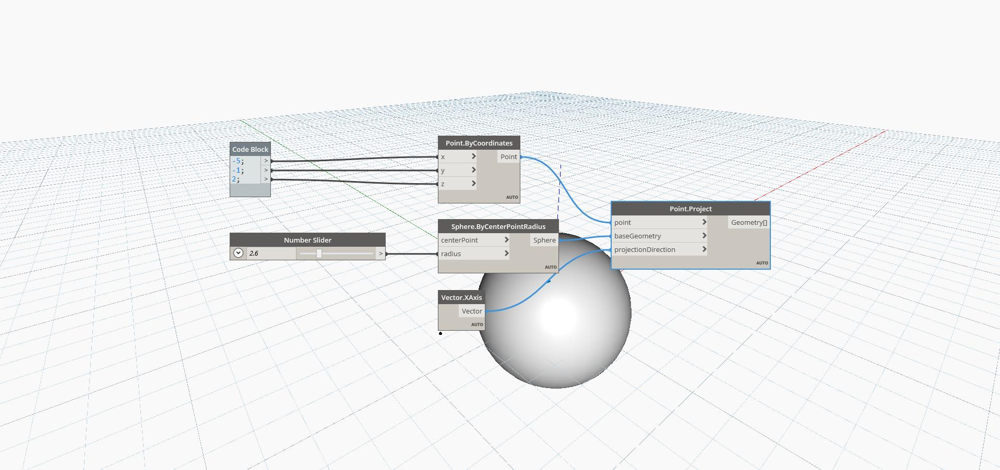

## In Depth
Project will project a point along a given vector direction onto a specified geometry. The projection is only attempted in the positve direction of the vector. If the vector does not intersect the given geometry, it will return null. In the example below, we create a point using a code block to specify the x,y, and z coordinates. We use a sphere as the geometry to project onto, and the world XAxis as the projection Direction. The output is a point on the surface of the sphere that is projected from the original point.
___
## Example File

