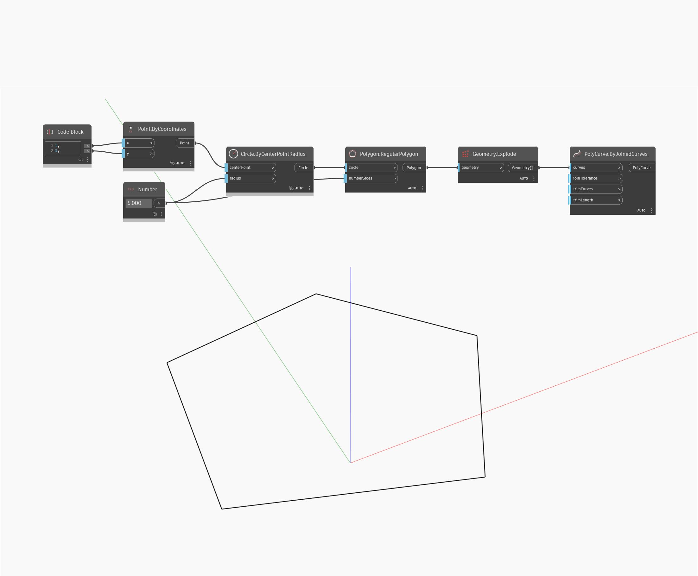

## In Depth
Polycurve By Joined Curves creates joined curves from a set of curves with matching vertices. In this example, a RegularPolygon is exploded into a curve list and is then rejoined into a Polycurve.
___
## Example File

