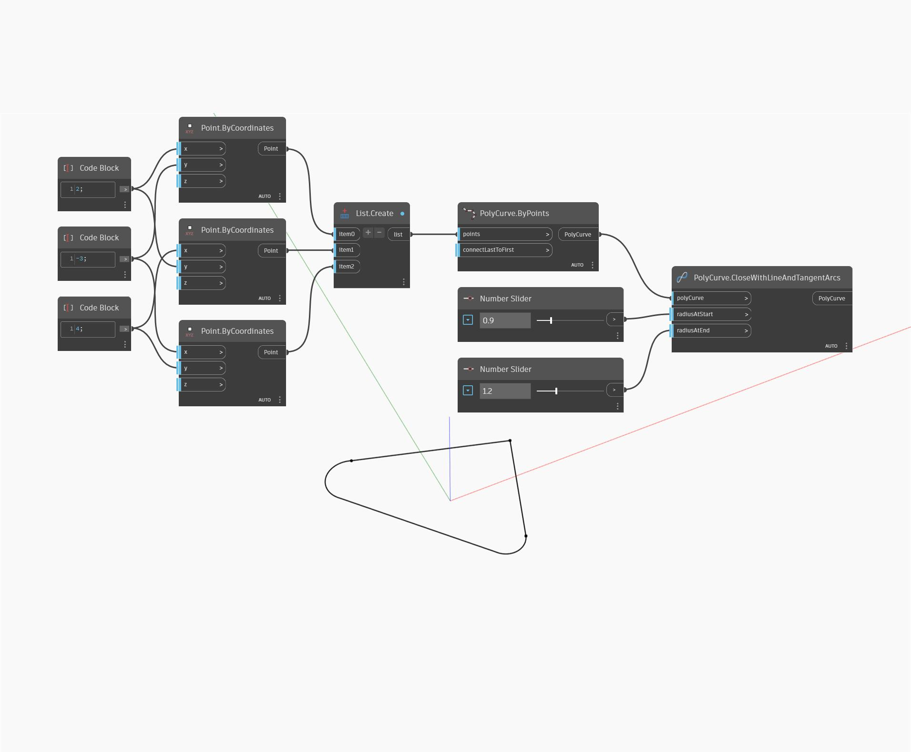

## In Depth
CloseWithLineAndTangentArcs will return a line and tangent arcs to close an open PolyCurve. In the example below, a PolyCurve with two segments is closed with a line and arcs. The arcs are defined by whether they are at the start or end of the new line, and their radii can be controlled independently.
___
## Example File

