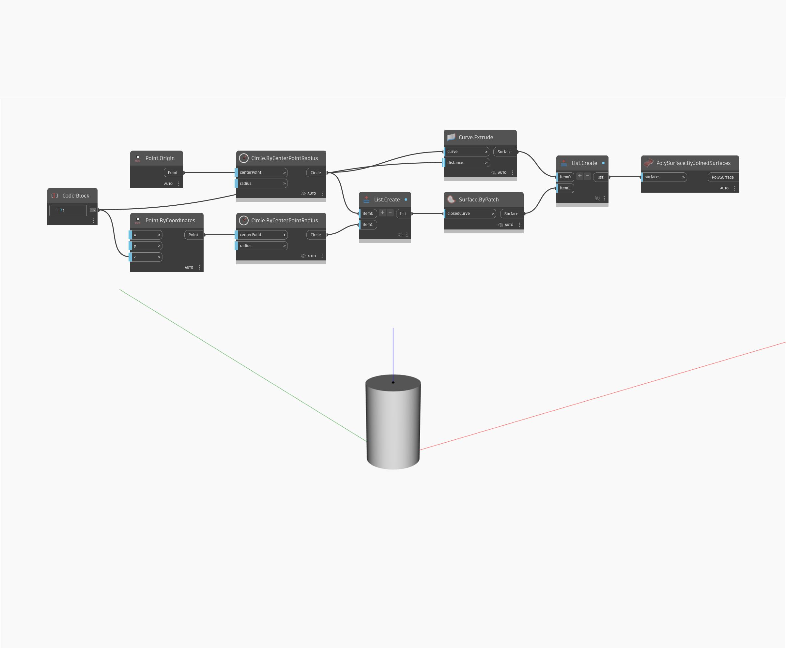

## In Depth
Solid by Joined Surfaces takes a list of surfaces as an input and will return a single solid defined by the surfaces. The surfaces must define a closed surface. In the example below, we start with a circle as a base geometry. The circle is patched to create a surface, and that surface is translated in the z-direction. We then extrude the circle to produce the sides. List.Create is used to make a list consisting of the base, side, and top surfaces, and then we use ByJoinedSurfaces to turn the list into a single closed solid.
___
## Example File

