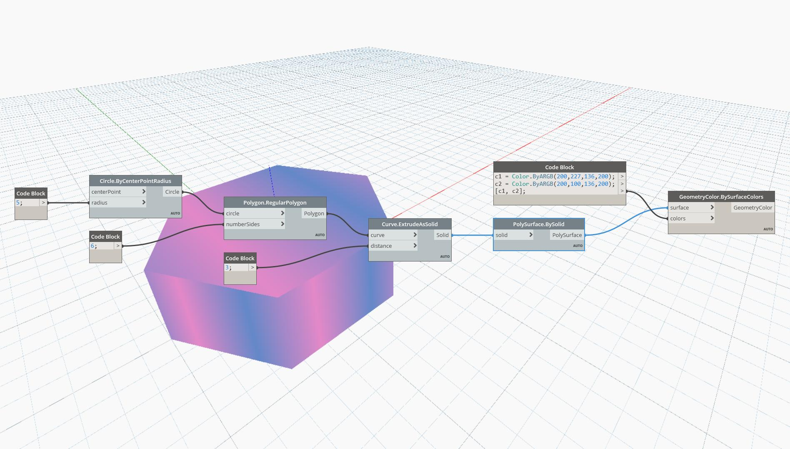

## In Depth
BySolid will return a PolySurface from a Solid. In the example below, a Solid is returned as a PolySurface for it to be an acceptable input to Display.BySurfaceColors.
___
## Example File

