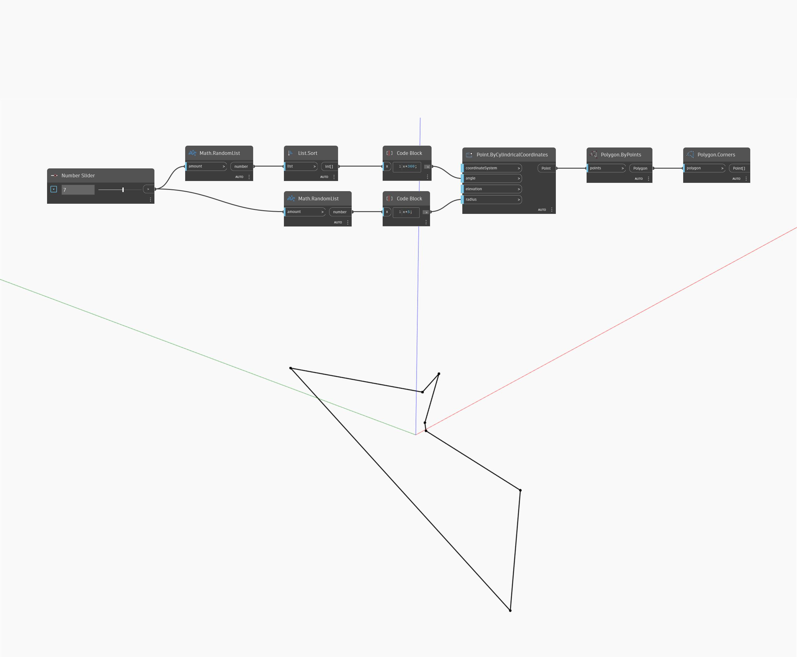

## In Depth
Corners will return a list of points that are the corners of the given polygon. In the example below, we first generate a set of random points sorted by angle to use with Polygon By Points. We can get the points back out as a list by using Corners.
___
## Example File

