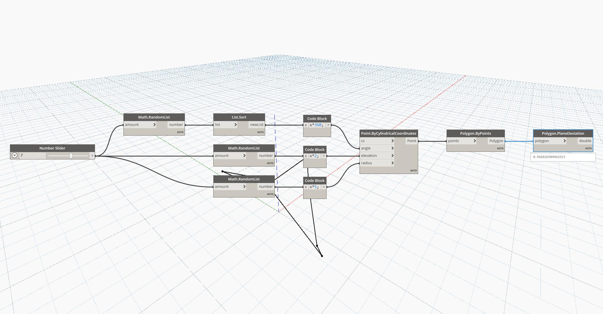

## In Depth
Plane Deviation will first calculate the best fit plane through the points of a given polygon. It then computes the distance of each point to that plane to find the maximum deviation of the points from the best fit plane. In the example below, we generate a list of random angles, elevations, and radii, and then use Points By Cylindrical Coordinates to create a set of non-planar points to use for Polygon By Points. Inputting this polygon into PlaneDeviation, we can find the average deviation of the points from a best-fit-plane.
___
## Example File

