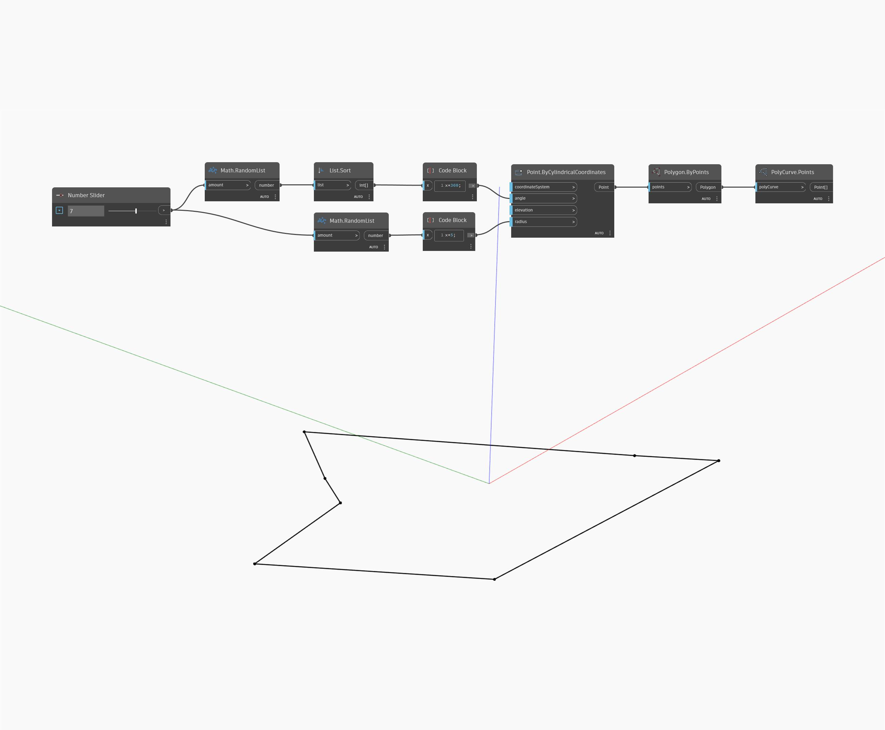

## In Depth
The points of an underlying mesh are useful for querying elevation or location data. Point sets can be manipulated in Dynamo and fed back into Dynamo as a new topography.
___
## Example File

