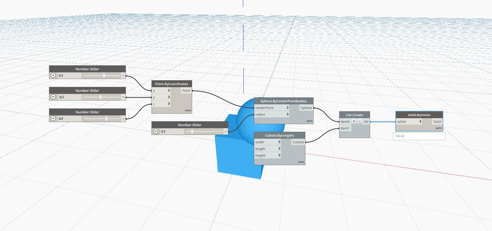

## In Depth
Solid by Union will create a single new solid out of the union of a list of closed solids. The union is the combination of both solids, and the new solid will include all of the volume of the original solids. In the example below, we use a set of number sliders to control the position and radius of a sphere. We also use a default cuboid. We use a List.Create node to put both the cube and the sphere into a single list, which we use as the input for Solid ByUnion node.
___
## Example File

