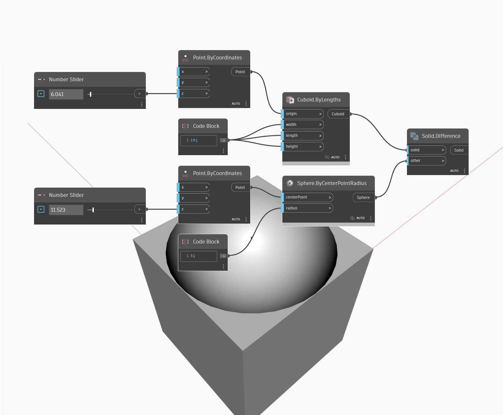

## In Depth
Difference will create a new solid by subtracting one solid from another. The 'solid' input indicates the solid to subtract from, while the 'tool' input is the solid that will be subtracted. In the example below, we start with a default cube as the solid we are going to subtract from. We use a series of number sliders to control the position and radius of a sphere, which we use as the tool. If the sphere is intersecting the cube, then the result is a cube with the intersecting part of the sphere subtracted from it.
___
## Example File

