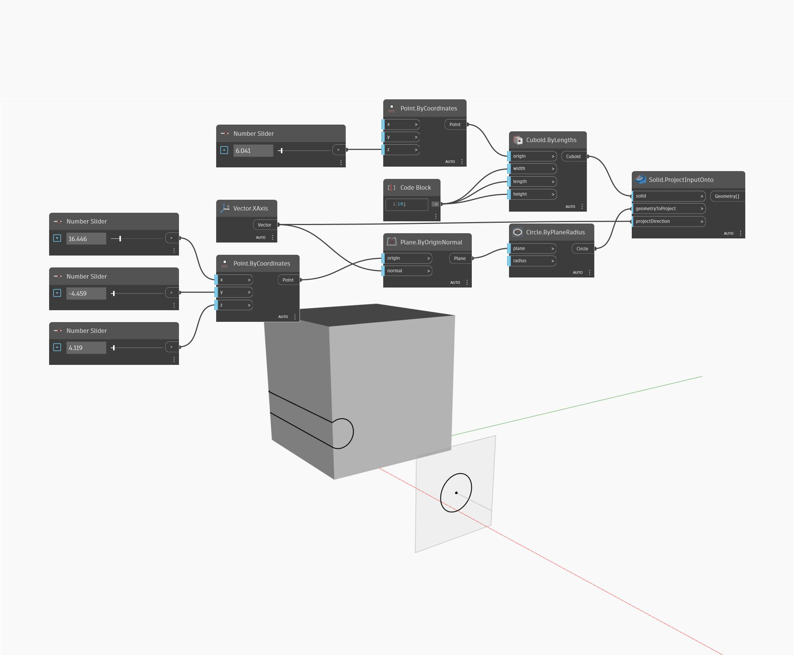

## In Depth
Project Input Onto will project an input geometry onto a given surface along a given direction. In the example below, we first create a surface by using a BySweep2Rails. This is the surface we will project onto. We make a circle at the origin to use as the geometry to project, and simply use the world Z-direction as the direction vector for projection. The result is a circle projected onto the surface.
___
## Example File

