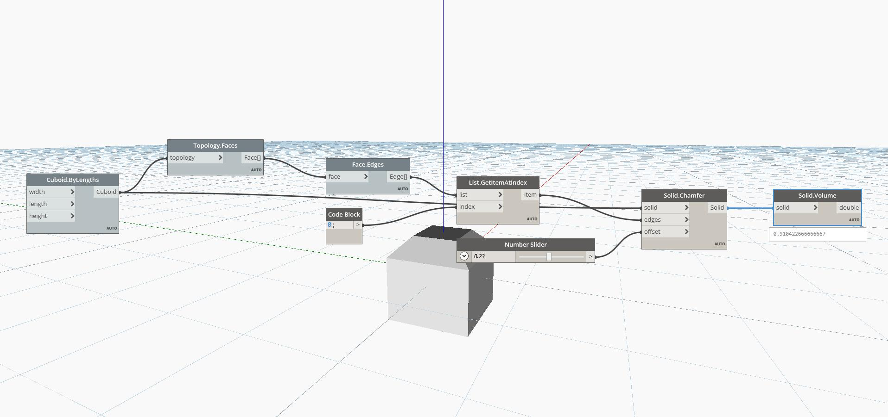

## In Depth
Volume will return the volume of a given solid. In the example below, we start with a cube, and then chamfer the edges to produce a new solid. We can use Volume to find the new volume of this solid.
___
## Example File

