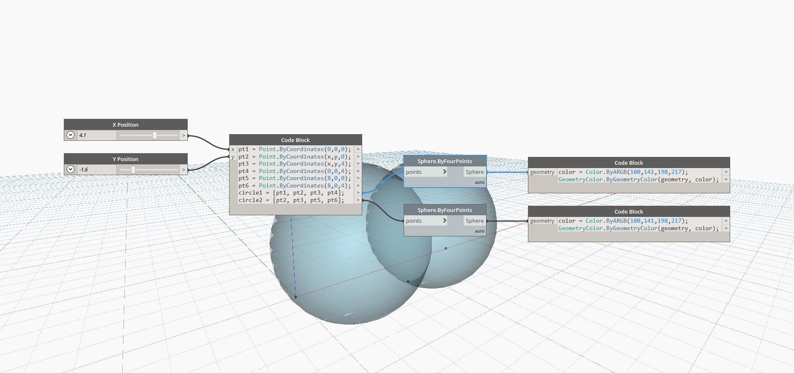

## In Depth
ByFourPoints will return a Sphere from four input Points on the Surface. In the example below, two Spheres are created from a collection of six Points. Adjusting the X Position and Y Position sliders will change the size of each Sphere relative to the other. It is important to note that not any collection of four points will make a Sphere. It has to be possible for all Points to be on the Sphere's surface.
___
## Example File

