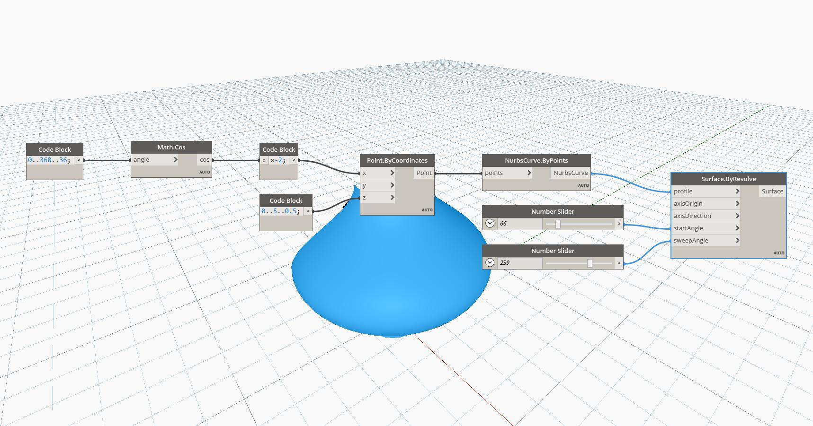

## In Depth
Surface by Revolve creates a surface by rotating a given profile curve around an axis. The axis is defined by an axisOrigin point, and an axisDirection vector. The start angle determines where to begin the surface, measured in degrees, and the sweepAngle determines how far around the axis to continue the surface. In the example below, we use a curve generated with a cosine function as the profile curve, and two number sliders to control the startAngle and sweepAngle. The axisOrigin and axisDirection are left at the default values of the world origin and world z-axis for this example
___
## Example File

