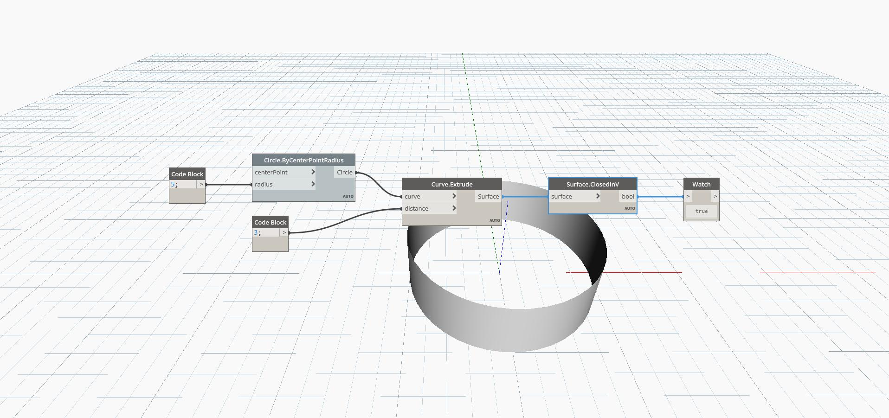

## In Depth
ClosedInV will return a boolean value based on whether a Surface is closed in it's V direction. In the example below, an extruded circle that is closed in one direction returns true for being closed in V
___
## Example File

