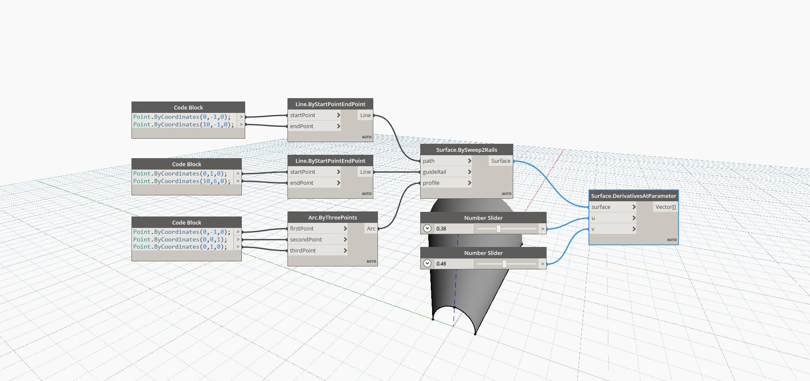

## In Depth
Derivatives At Parameter uses U and V input parameters and returns the U and V derivaties of the surface at the input UV position on the surface. The derivatives are returned as a list of two vectors, with the first vector being the U derivative and the second vector being the V derivative. In the example below, we first create a surface by using a BySweep2Rails. We then use two number sliders to determine the U and V parameters to determine the derivatives with a DerivativesAtParameter node. 
___
## Example File

