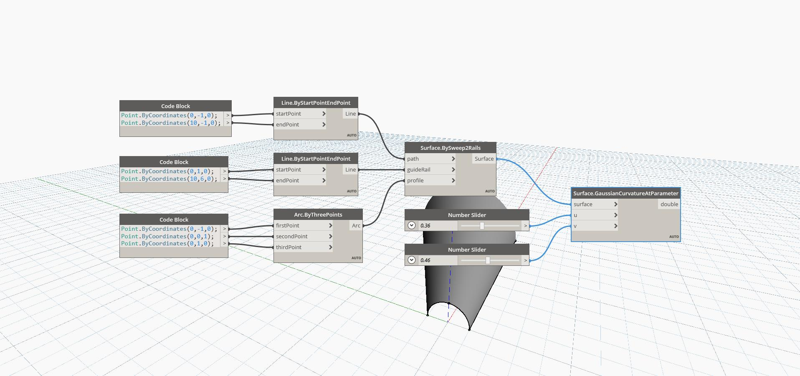

## In Depth
Gaussian Curvature At Parameter uses U and V input parameters and returns the curvature of the surface at the input UV position of the surface. The Gaussian Curvature is calculated as the product of the two principal curvatures (in the U and V directions). In the example below, we first create a surface by using a BySweep2Rails. We then use two number sliders to determine the U and V parameters to find the gaussian curvature with a GaussianCurvatureAtParameter node.
___
## Example File

