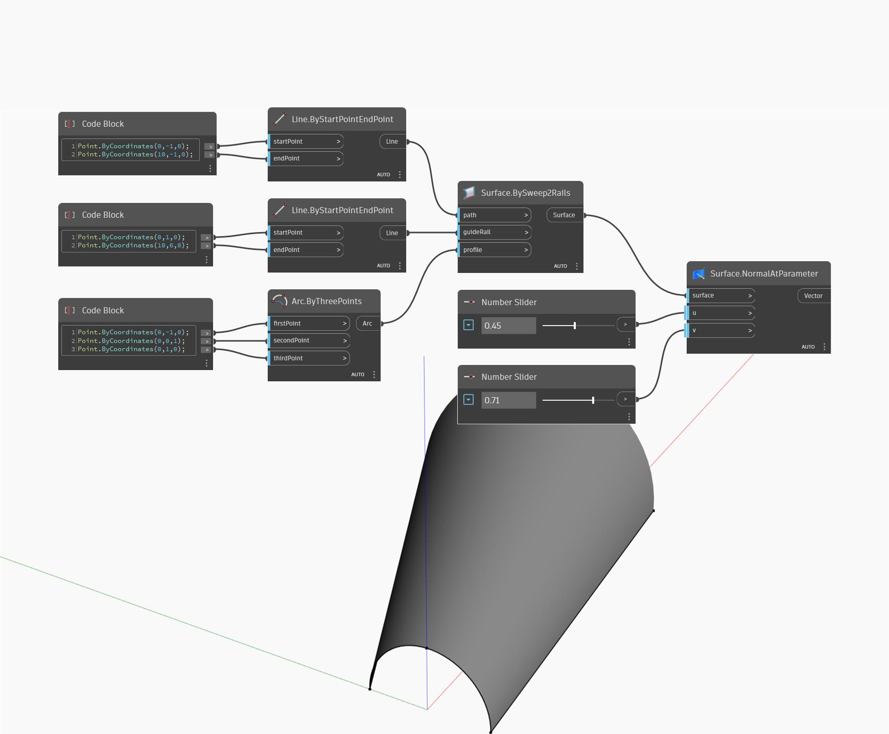

## In Depth
Normal At Parameter uses U and V input parameters and returns the Normal vector of the surface at the input UV position on the surface. In the example below, we first create a surface by using a Sweep2Rails. We then use two number sliders to determine the U and V parameters to determine the Normal with a NormalAtParameter node.
___
## Example File

