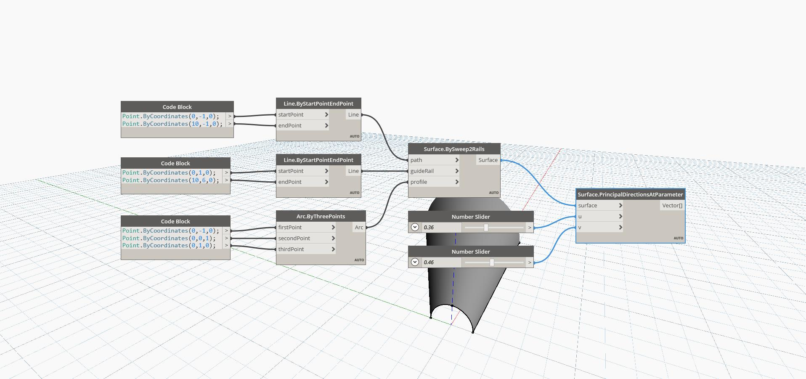

## In Depth
Principal Directions at Parameter uses U and V input parameters and returns the curvatures in the U and V directions. This node returns a list of two vectors, with the first being the direction vector in the U direction and the second being the direction vector in the V direction. In the example below, we first create a surface by using a BySweep2Rails. We then use two number sliders to determine the U and V parameters to find the directions using a PrincipalDirectionsAtParameter node.
___
## Example File

