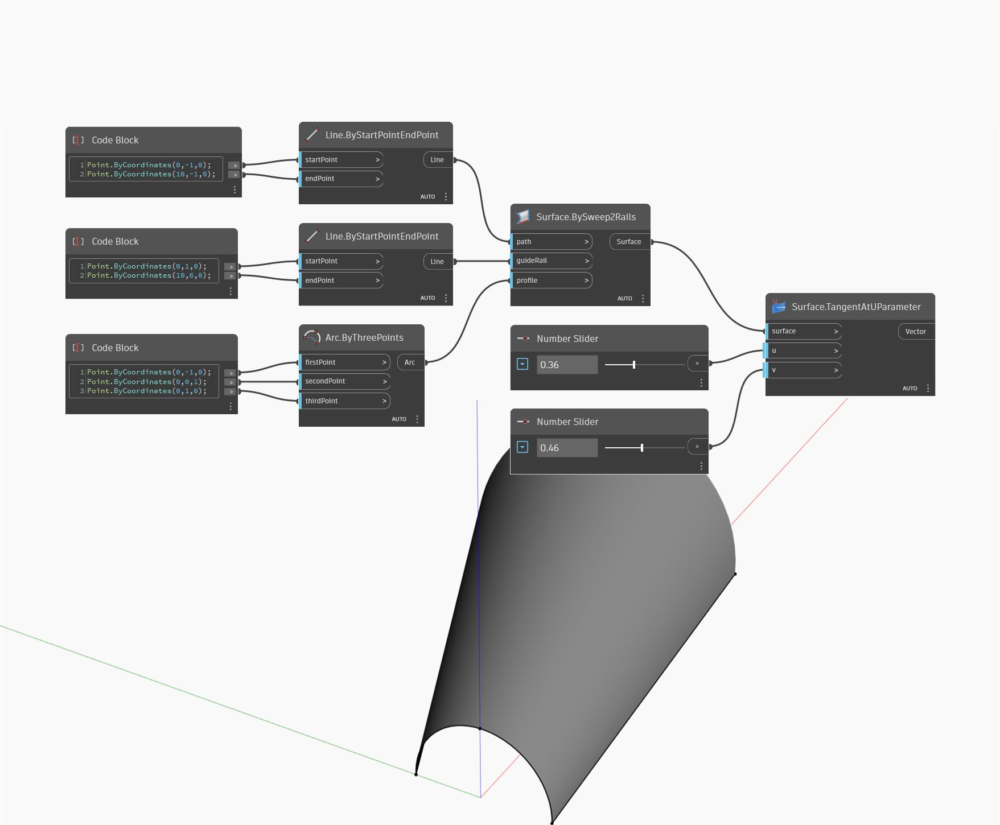

## In Depth
Tangent at U Parameter will return the tangent vector in the U direction at a specified UV position on a surface.  In the example below, we first create a surface by using a BySweep2Rails. We then use two number sliders to determine the U and V parameters to find the U tangent vector.
___
## Example File

