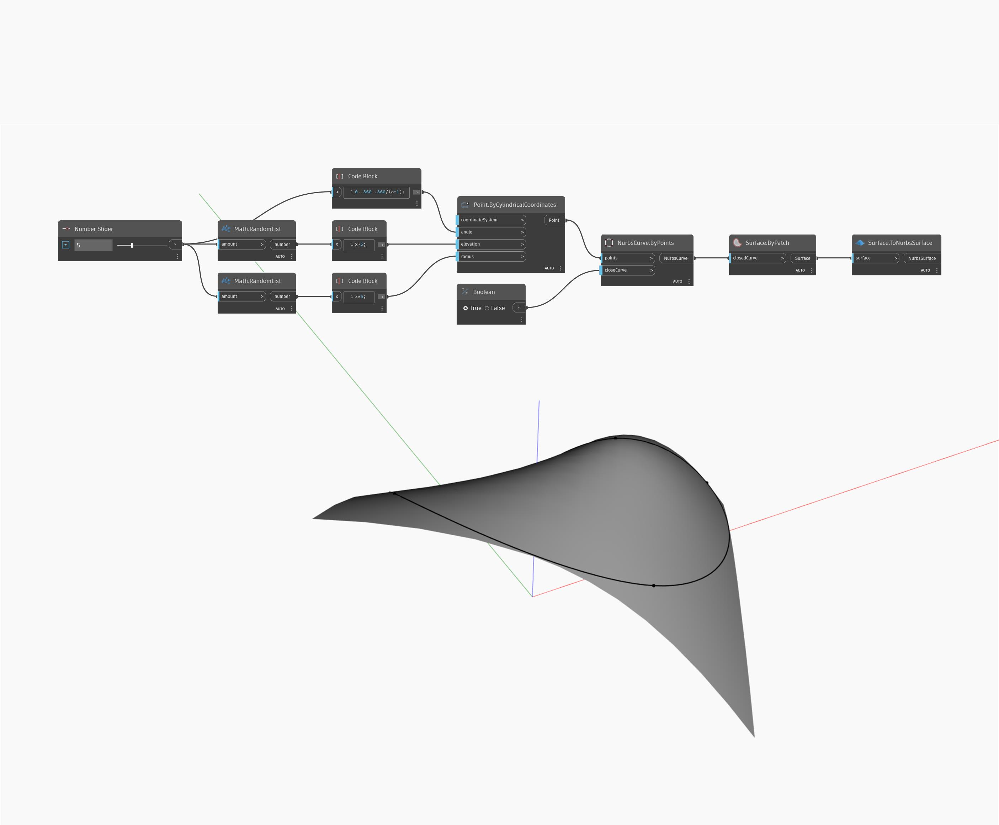

## In Depth
Surface To Nurbs Surface takes a surface as input and returns a Nurbs Surface that approximates the input surface. In the example below, we create a surface using a ByPatch node with a close Nurbs Curve as an input. Note that when we use this surface as the input for a ToNurbsSurface node, the result is an untrimmed Nurbs Surface with four sides.
___
## Example File

