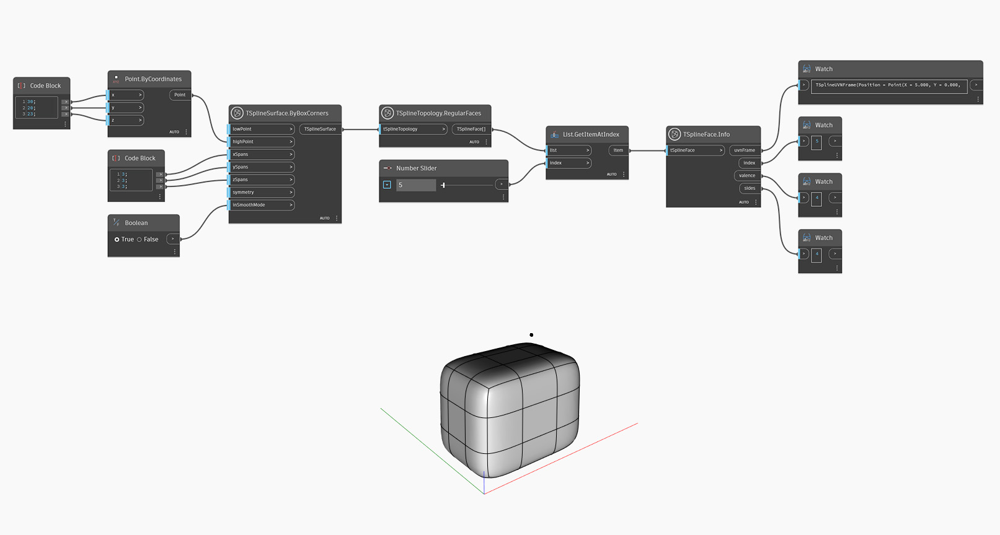

## In-Depth
`TSplineFace.Info` returns the following properties of a T-Spline Face: 
- `uvnFrame`: point on the hull, U vector, V vector, and normal vector of the T-Spline Face
- `index`: the index of face
- `valence`: number of vertices or edges that form a face
- `sides`: the number of edges of each T-Spline Face

In the example below, `TSplineSurface.ByBoxCorners` and `TSplineTopology.RegularFaces` are used to respectively create e T-Spline and select its faces. `List.GetItemAtIndex` is used to pick a specific face of the T-Spline, and `TSplineFace.Info` is used to find out its properties.

## Example File

