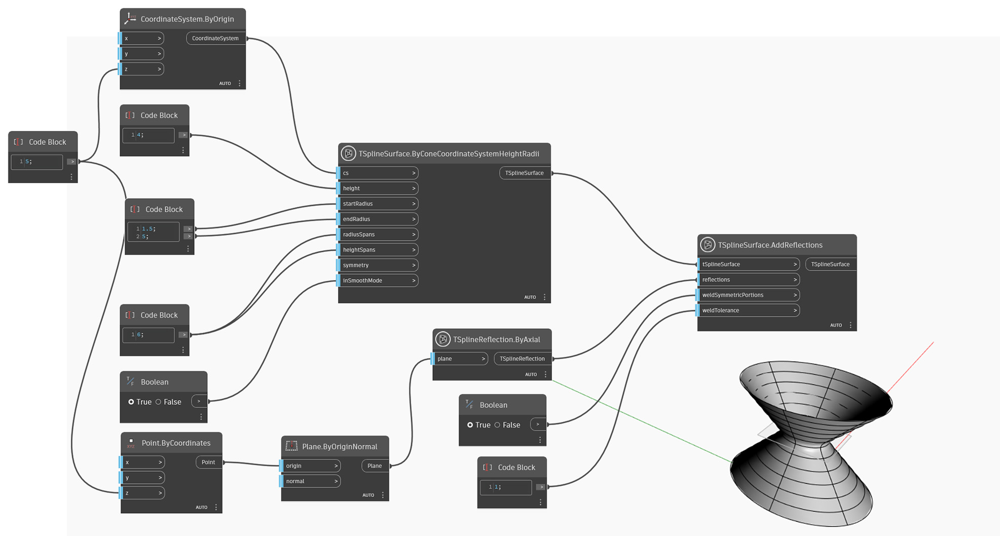

## In-Depth
`TSplineReflection.ByAxial` returns a `TSplineReflection` object that can be used as input for the `TSplineSurface.AddReflections` node. 
The input of the `TSplineReflection.ByAxial` node is a plane that serves as a mirror plane. Much like TSplineInitialSymmetry, TSplineReflection, once established for the TSplineSurface, influences all subsequent operations and alterations.

In the example below, `TSplineReflection.ByAxial` is used to create a TSplineReflection positioned at the top of the T-Spline Cone. The reflection is then used as input for the `TSplineSurface.AddReflections` nodes to reflect the cone and return a new T-Spline surface. 

## Example File

