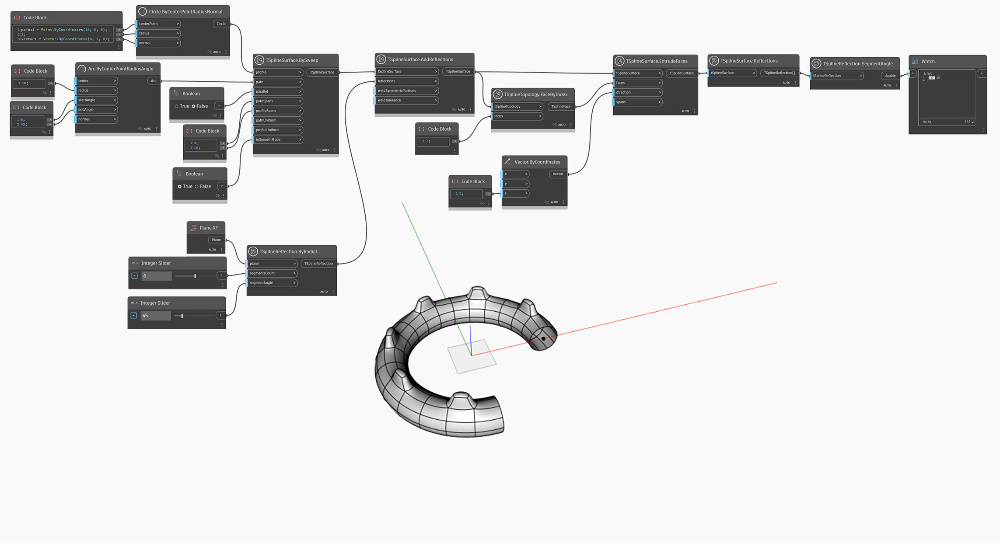

## In-Depth
`TSplineReflection.SegmentAngle` returns the angle between every pair of Radial Reflection segments. If the type of TSplineReflection is Axial, the node returns 0. 

In the example below, a T-Spline surface is created with added Reflections. Later in the graph, the surface is interrogated with `TSplineSurface.Reflections` node. The result (a Reflection) is then used as input for the `TSplineReflection.SegmentAngle` to return the angle between the segments of a Radial Reflection.

## Example File

