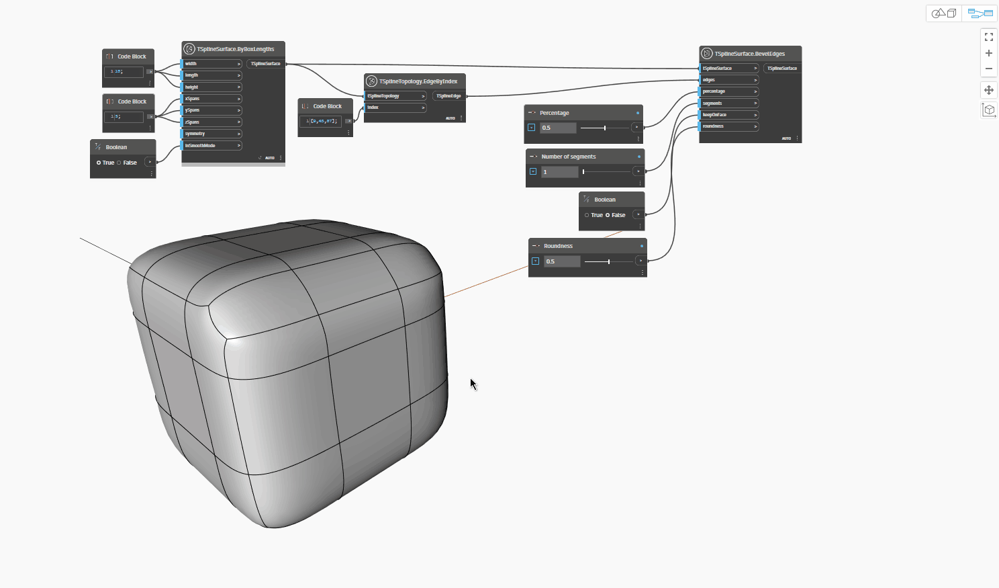

## In-Depth
The `TSplineSurface.BevelEdges` node offsets a selected edge or a group of edges in both directions along the face, substituting the original edge with a sequence of edges forming a channel.

In the example below, a group of edges of a T-Spline box primitive is used as input for the `TSplineSurface.BevelEdges` node. The example illustrates how the following inputs impact the result:
- `percentage controls` the distribution of the newly created edges along the neighboring  faces, zero-adjacent values positioning new edges closer to the original edge and values approaching 1 being further away.
- `numberOfSegments` controls the number of new faces in the channel.
- `keepOnFace` defines if the bevel edges are placed in the plane of the original face. If the value is set to True, the roundness input has no effect.
- `roundness` controls how rounded the bevel is and expects a value in the range between 0 and 1, with 0 resulting in a straight bevel and 1 returning a bevel that is rounded.

Box mode is occasionally turned on to get a better understanding of the shape.

## Example File

