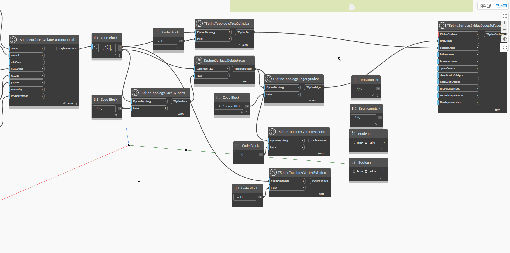

## In Depth
`TSplineSurface.BridgeEdgesToFaces` connects a sets of edges with a set of faces, either from the same surface or from two different surfaces. The edges making up the faces need to match in number, or be a multiple of the edges on the other side of the bridge. The node requires the inputs described below. The first three inputs are enough to generate the bridge, the rest of the inputs being optional. The resulting surface is a child of the surface that the first group of edges belongs to.

- `TSplineSurface`: the surface to bridge
- `firstGroup`: Edges from the TSplineSurface selected
- `secondGroup`: Faces from either the same T-Spline surface selected, or from a different one.
- `followCurves`: (optional) a curve for the bridge to follow. In the absence of this input, the bridge follows a straight line
- `frameRotations`: (optional) number of rotations of the bridge extrusion that connects the chosen edges.
- `spansCounts`: (optional) number of spans/segments of the bridge extrusion that connects the chosen edges. If the number of spans is too low, certain options might not be available until it is increased.
- `cleanBorderBridges`:(optional) deletes bridges between border bridges to prevent creases
- `keepSubdCreases`:(optional) preserves the SubD-creases of the input topology, resulting in a creased treatement of the start and end of the bridge
- `firstAlignVertices`(optional) and `secondAlignVertices`: enforce the alignment between two sets of vertices instead of automatically choosing to connect pairs of closest vertices.
- `flipAlignFlags`: (optional) reverses the direction of vertices to align

In the example below, two T-Spline planes are created and sets of edges and faces are collected using `TSplineTopology.VertexByIndex` and `TSplineTopology.FaceByIndex` node. To create a bridge, the faces and edges are used as input for the `TSplineSurface.BrideEdgesToFaces` node, along with one of the surfaces. This creates the bridge. More spans are added to the bridge by editing the `spansCounts` input. When a curve is used as input for `followCurves`, the bridge follows the direction of the provided curve. `keepSubdCreases`,`frameRotations`, `firstAlignVertices` and `secondAlignVertices` inputs demonstrate how the shape of the bridge can be fine-tuned. 

## Example File

