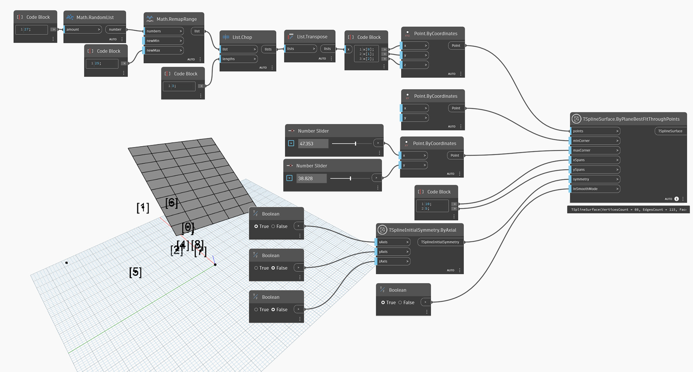

## In-Depth
`TSplineSurface.ByPlaneBestFitThroughPoints` generates a T-Spline primitive plane surface from a list of points. To create the T-Spline Plane, the node uses the following inputs:
- `points`: a set of points to define the plane orientation and origin. In cases where the input points do not lie on a single plane, the plane`s orientation is determined based on the best fit. A minimum of three points is required to create the surface.
- `minCorner` and `maxCorner`: the corners of the plane, represented as Points with X and Y values (Z coordinates will be ignored). These corners represent the extents of the output T-Spline surface if it is translated onto the XY plane. The `minCorner` and `maxCorner` points do not have to coincide with the corner vertices in 3D. 
- `xSpans` and `ySpans`: number of width and length spans/divisions of the plane
- `symmetry`: whether the geometry is symmetrical in respect to its X, Y and Z axes
- `inSmoothMode`: whether the resulting geometry will appear with smooth or box mode

In the example below, a T-Spline planar surface is created using a randomly generated list of points. The size of the surface is controlled by the two points used as `minCorner` and `maxCorner` inputs. 

## Example File

