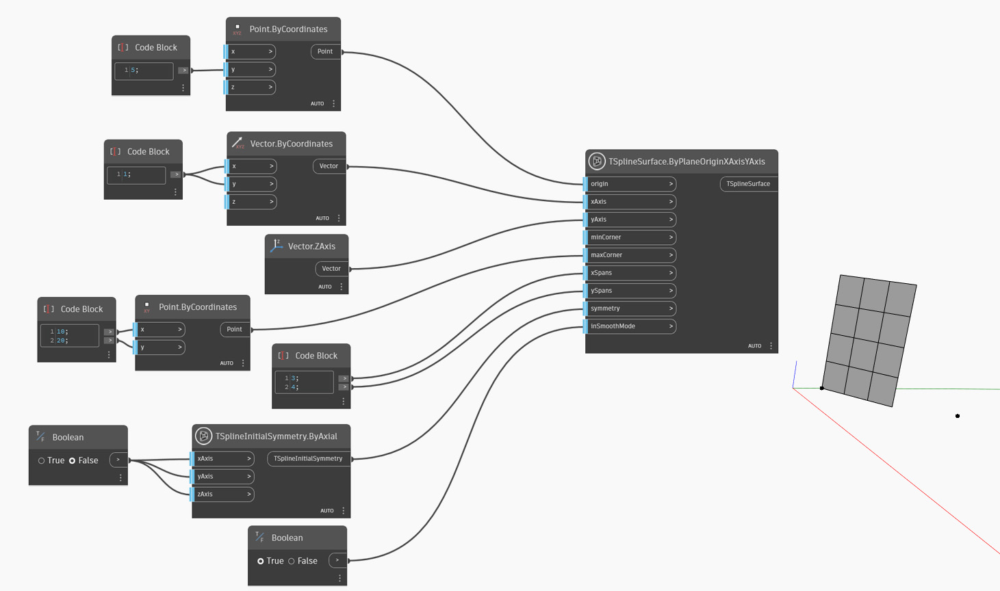

## In-Depth
`TSplineSurface.ByPlaneOriginXAxisYAxis` generates a T-Spline primitive plane surface using an origin point and two vectors representing the X and Y axes of the plane. To create the T-Spline Plane, the node uses the following inputs:
- `origin`: a point defining the origin of the plane.
- `xAxis` and `yAxis`: vectors defining the direction of the X and Y axes of the created plane.
- `minCorner` and `maxCorner`: the corners of the plane, represented as Points with X and Y values (Z coordinates will be ignored). These corners represent the extents of the output T-Spline surface if it is translated onto the XY plane. The `minCorner` and `maxCorner` points do not have to coincide with the corner vertices in 3D. For example, when a `minCorner` is set to (0,0) and `maxCorner` is (5,10), the plane width and length will be 5 and 10 respectively. 
- `xSpans` and `ySpans`: number of width and length spans/divisions of the plane
- `symmetry`: whether the geometry is symmetrical with respect to its X, Y and Z axes
- `inSmoothMode`: whether the resulting geometry will appear with smooth or box mode

In the example below, a T-Spline planar surface is created by using the provided origin point and two vectors serving as X and Y directions. The size of the surface is controlled by the two points used as `minCorner` and `maxCorner` inputs. 

## Example File

