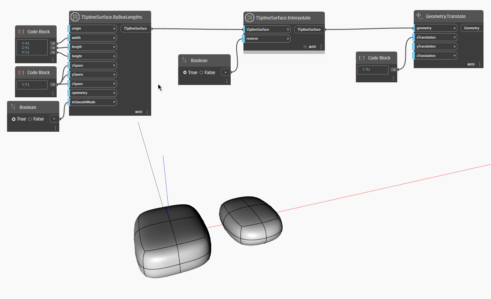

## In Depth
In the example below, Interpolate operation is used on a T-Spline box surface. The result of `TSplineSurface.Interpolate` node is translated to the right of the original shape to visualize its effects. Box mode and smooth mode is enabled in turn to preview the results of forward and reverse interpolation. 
___
## Example File

