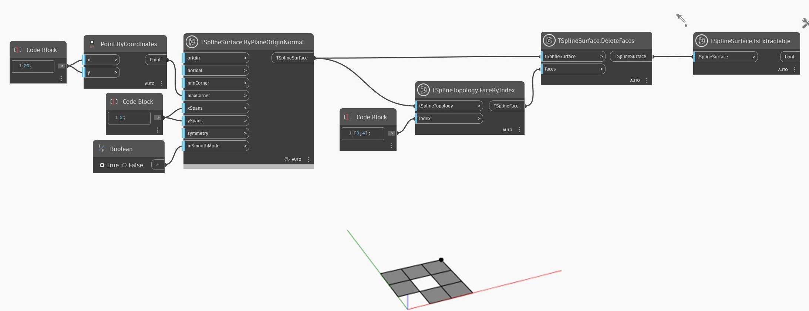

## In Depth
In the example below, some faces of a T-Spline surface are deleted and result in an invalid surface. Smooth mode cannot be activated for invalid surfaces and the result of `TSplineSurface.IsExtractable` node shows `false`.
___
## Example File

