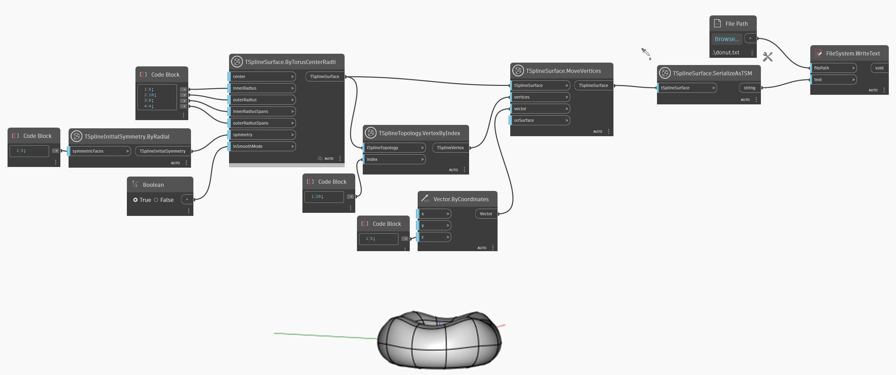

## In Depth
In the example below, a simple T-Spline surface is translated into string TSM format with `TSplineSurface.SerializeAsTSM` node and exported as a text file. This file can be later reconstructed using `TSplineSurface.DeserializeFromTSM` node.
___
## Example File

