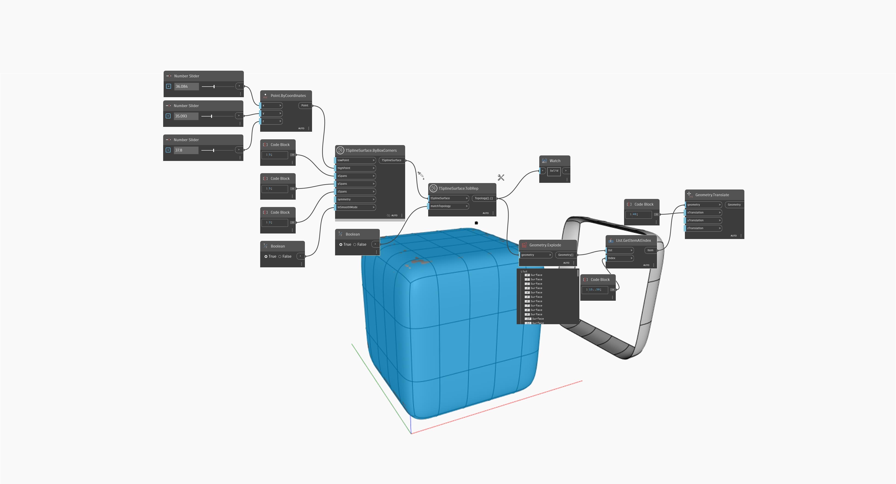

## In Depth
In the example below, a simple T-Spline box surface is converted into a BRep surface using `TSplineSurface.ToBRep` node. The result is a solid which supports operations such as `Explode`, as is demonstrated for the shape translated to the right of the original. 
___
## Example File

