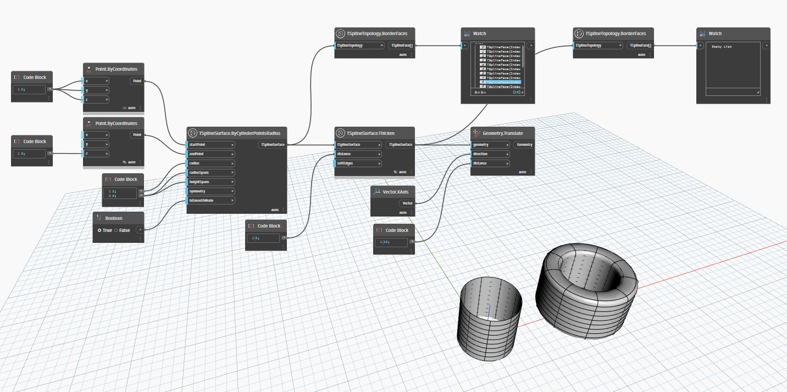

## In Depth
`TSplineTopology.BorderFaces` returns list of border faces contained in T-Spline surface.

In the example below, two T-Spline Surfaces are created through `TSplineSurface.ByCylinderPointsRadius`. One is an open surface, while the other is thickened using `TSplineSurface.Thicken`, which turns it into a closed surface. When both are examined with the `TSplineTopology.BorderFaces` node, the first one returns a list of border faces while the second one returns an empty list. That's because since the surface is enclosed, there are no border faces.
___
## Example File

