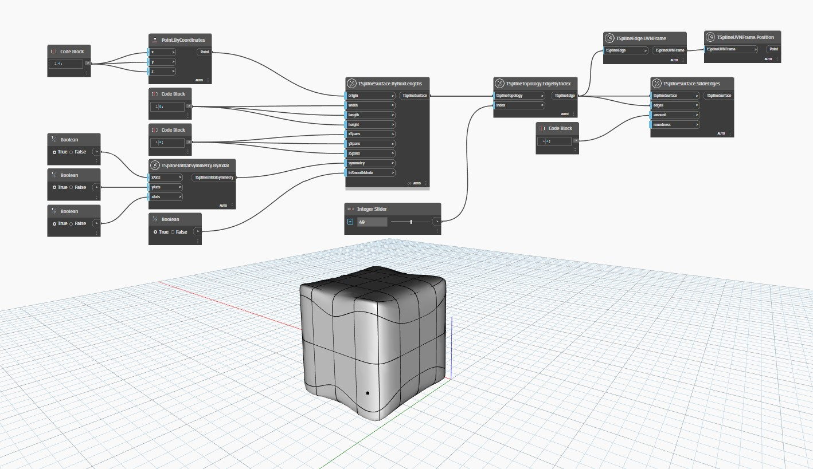

## In Depth
In the example below, a T-Spline box is created using the `TSplineSurface.ByBoxLengths` node with a specified origin, width, length, height, spans and symmetry. 
`EdgeByIndex` is then used to select an edge from the list of edges in the generated surface. The selected edge is then made to slide along neighboring edges using `TSplineSurface.SlideEdges`, followed by its symmetric counterparts.
___
## Example File

