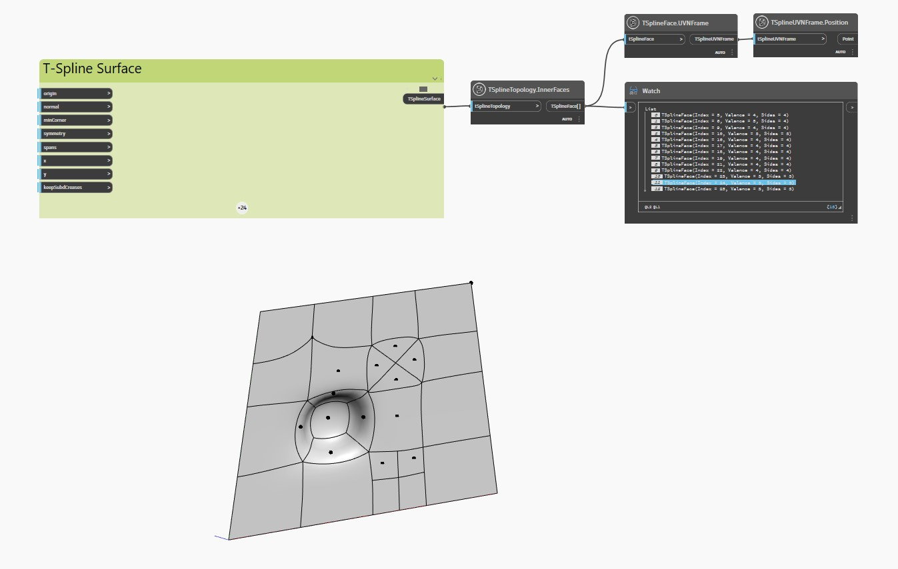

## In Depth
In the example below, a planar T-Spline surface with extruded, subdivided and pulled vertices and faces is inspected with the `TSplineTopology.InnerFaces` node.

The nodes `TSplineFace.UVNFrame` and `TSplineUVNFrame.Position` are used to highlight the center of the inner faces in the surface.
___
## Example File

