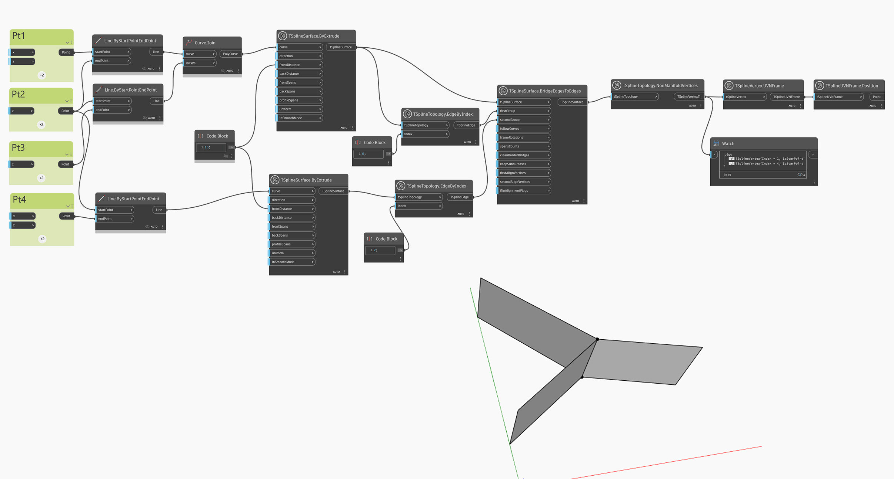

## In-Depth
`TSplineTopology.NonManifoldVertices` is used to identify non-manifold vertices from a T-Spline model. A non-manifold T-Spline surface can only be displayed in box mode. 

In the example below, a non-manifold T-Spline surface is created as a result of joining two surfaces that share the same edge. `TSplineTopology.NonManifoldVertices` and `TSplineUVNFrame.Position` nodes are used to highlight which vertices are non-manifold. 

## Example File

