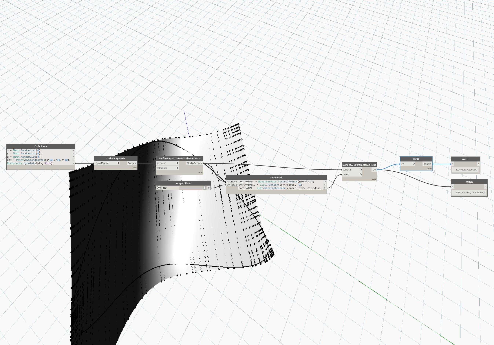

## In Depth
U will return the U value of a UV coordinate. In the example below, the U value of a Point location on the NurbsSurface is returned. The UV parameter is returned from the Surface.UVParamterAtPoint node.
___
## Example File

