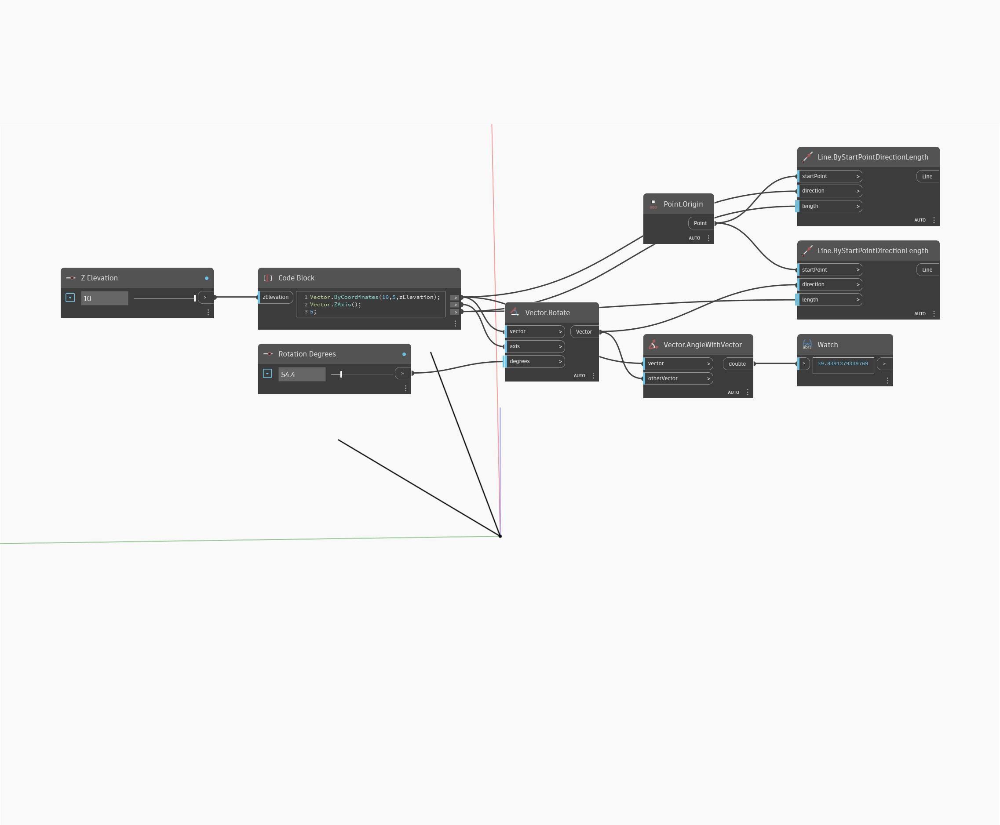

## In Depth
AngleWithVector will return the angle measurement between two Vectors in degrees from 0 to 180. In the example below, an angle measurement is returned for two Vectors. Adjust Z Elevation and Rotation Degrees sliders to see how they affect the resulting angle measurement. The Vectors are represented as Lines.
___
## Example File

