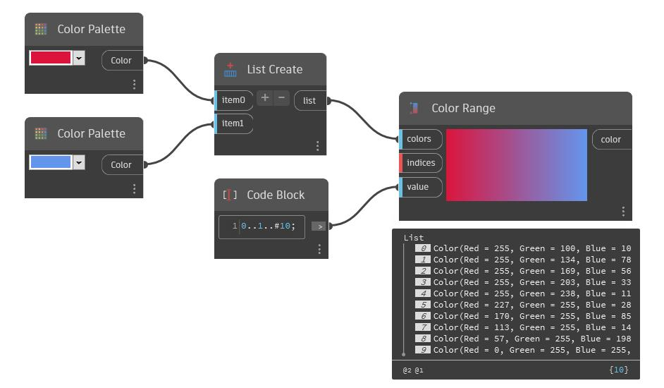

## In Depth
Color Range will create a gradient between a set of input colors, and allow colors from that gradient to be selected by a list of input values. The first input, colors, is a list of colors to use in the gradient. The second inut, indices, will determine the relative location of the input colors in the gradient. This list should correspond to the list of colors, each value being in the range 0 to 1. The exact value is not important, only the relative position of the values. The color corresponding to the lowest value will be on the left of the gradient, and the color corresponding to the highest value will be on the right side of the gradient. The final values input allows the user to select points along the gradient in the range 0 to 1 to output. In the example below, we first create two colors: red and green. The order of these colors in the gradient is determined by a list that we create with a code block. A third code block is used to create a range of numbers between 0 and 1 that will determine the output colors from the gradient. A set of cubes is generated along the x-axis, and these cubes are finally colored according the gradient by using a Display.ByGeometryColor node.
___
## Example File

