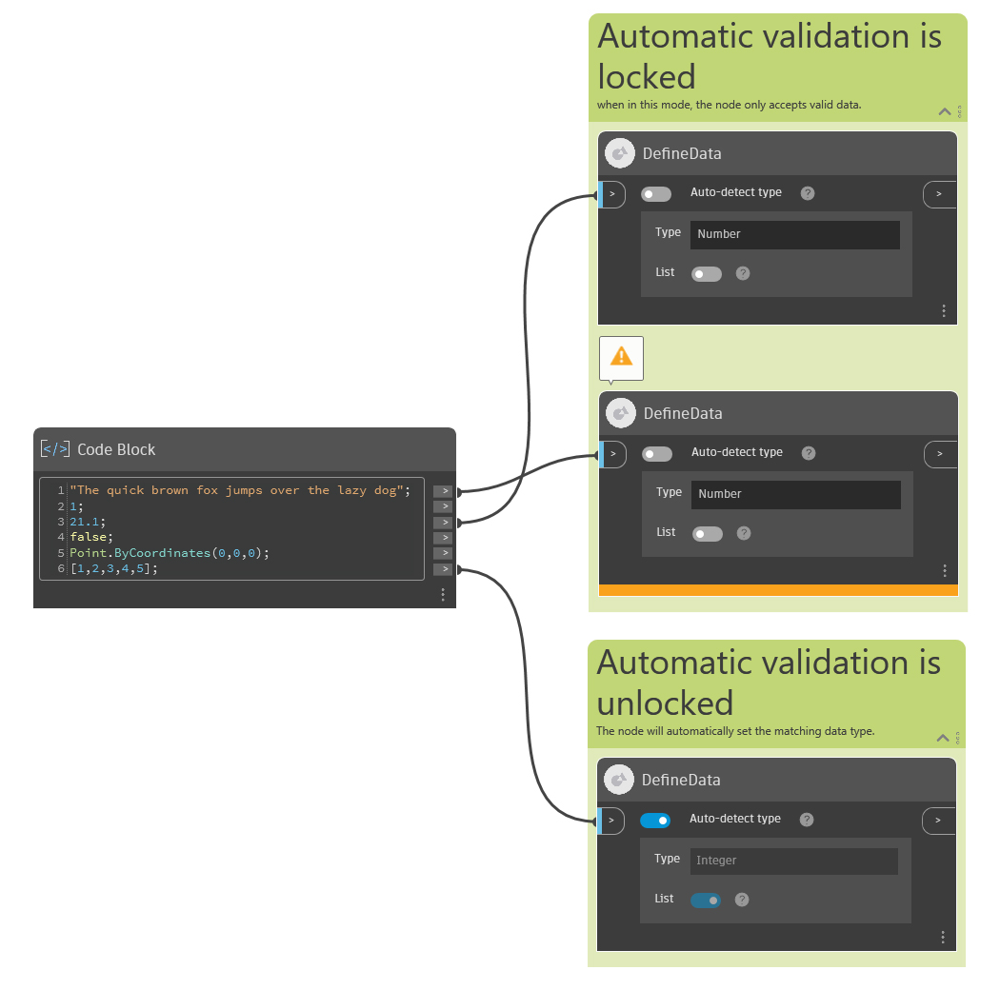

## In Depth

The Define Data node validates the data type of incoming data. It can be used to ensure local data is of the desired type, and it's also designed to be used as an input or output node that declares the type of data a graph expects or provides. The node supports a selection of commonly used Dynamo data types, for example "String", "Point", and "Boolean". The full list of supported data types is available in the node's drop-down menu. The node supports data in the form of a single value or a flat list. Nested lists, dictionaries, and replication are not supported.

### Behavior

The node validates the data coming in from the input port based on the setting of the Type drop-down menu and the List toggle (see below for details). If the validation is successful, the output of the node is the same as the input. If the validation is not successful, the node will enter a warning state with a null output.
The node has one input:

-   The "**>**" input - Connect to an upstream node to validate the type of its data.
    Additionally, the node offers three user controls:
-   The **Auto-detect type** toggle - When toggled on, the node analyzes the incoming data, and if the data is of a supported type, the node sets the Type and List controls' values based on the type of the incoming data. The Type drop-down menu and the List toggle are disabled and will automatically update based on the input node.
    When Auto-detect type is toggled off, you can specify a data type by using the Type menu and List toggle. If the incoming data does not match what you've specified, the node will enter a warning state with a null output.
-   The **Type** drop-down menu - Sets the expected data type. When the control is enabled (**Auto-detect type** toggle is off), set a data type for validation. When the control is disabled (**Auto-detect type** toggle is on), the data type is set automatically based on incoming data. Data is valid if its type matches the shown type exactly or if its type is a child of the shown type (for example, if the Type drop-down is set to "Curve", objects of type "Rectangle", "Line", etc. are valid).
-   The **List** toggle - When on, the node expects incoming data to be a single flat list containing items of a valid data type (see above). When off, the node expects a single item of a valid data type.

### Use as an input node

## When set as an input ("Is Input" in the node's context menu), the node can optionally use upstream nodes to set the default value for the input. A run of the graph will cache the Define Data node's value for use when running the graph externally, for example with the Engine node.

## Example File

In the example below, the first group of "DefineData" nodes have the **Auto-detect type** toggle off. The node correctly validates the Number input provided while rejecting the String input. The second group contains a node with **Auto-detect type** toggled on. The node automatically adjusts the Type drop-down and the List toggle to match the input, in this case a list of integers.

