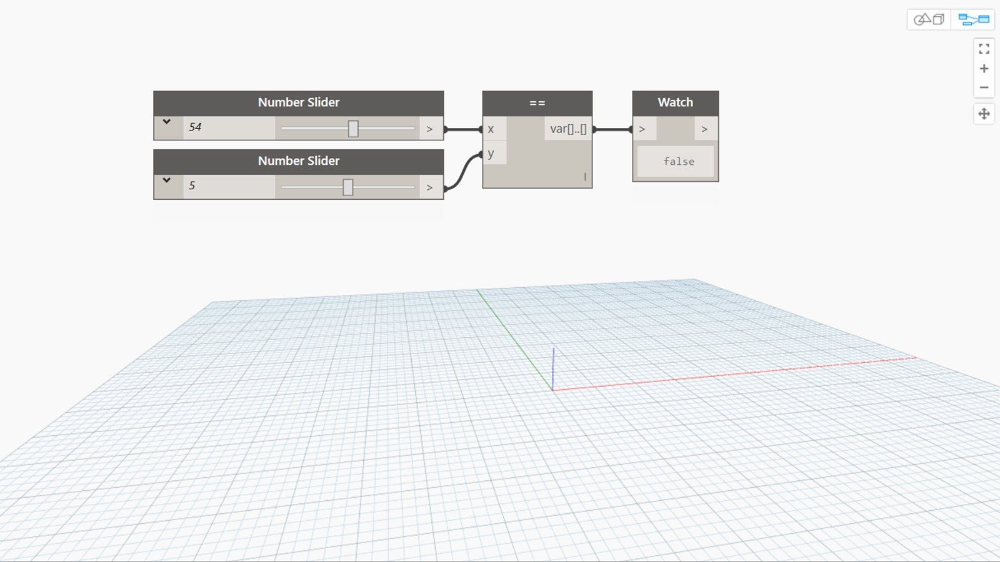

## In Depth
== is the Equal To operator. If the x input is equal to the y input, it will return true. If the two values are not equal, this operator will return false. In the example below, we use two number sliders to control the inputs to the == operator.
___
## Example File

