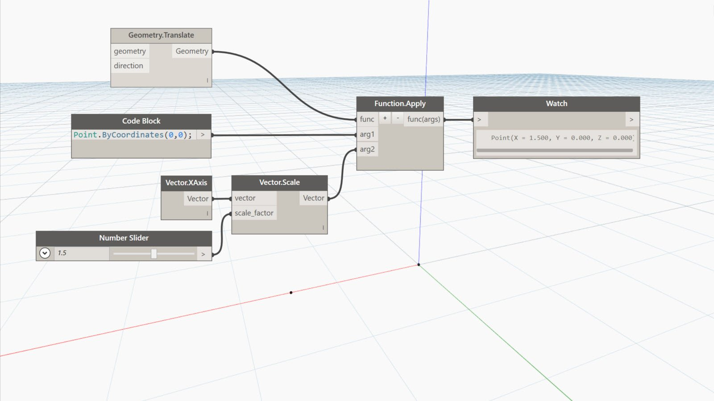

## In Depth
Function.Apply will return the result of a function with supplied arguments. In the example below, arguments of a point and vector are applied to a translate function returning a translated point.
___
## Example File

