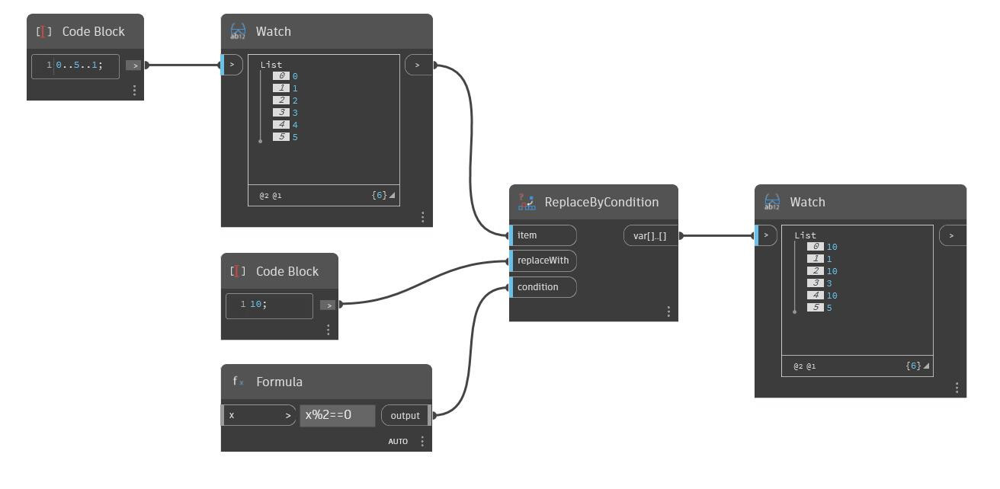

## In Depth
Replace By Condition will take a given list and evaluate each item with a given condition. If the condition evaluates to 'true', the corresponding item will be replaced in the output list with the item specified in the replaceWith input. In the example below, we use a Formula node and enter the formula x%2==0, which finds the remainder of a given item after dividing by 2, and then checks to see if that remainder is equal to zero. This formula will return 'true' for even integers. Note that the input x is left blank. Using this formula as the condition in a ReplaceByCondition node results in an output list where each even number is replaced by the specified item, in this case the integer 10.
___
## Example File

