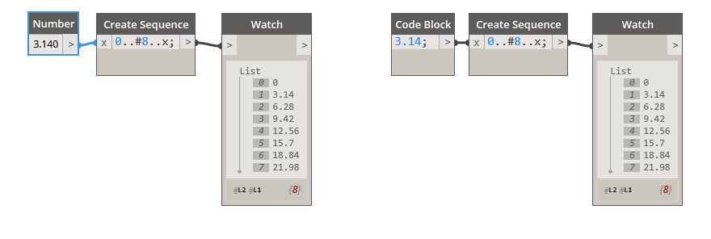

## In Depth
The Number node allows a user to enter a static number. This node is useful for things like constants that don't change values. Numbers can also be created by using a Code Block node. In the example below, the number is paired with a code block to create a list sequence with a variable step size.
___
## Example File

