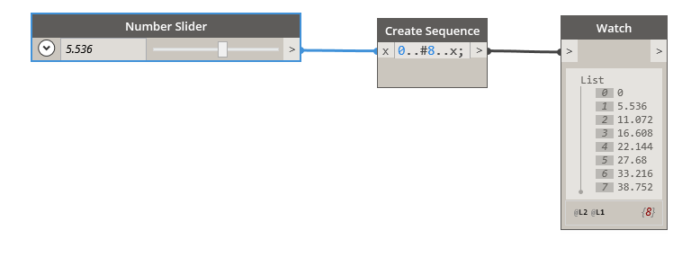

## In Depth
The Number Slider is a customizable, tactile node that allows us to interface with the data driving our Dynamo definitions. Here, the number slider is paired with a code block to create a dynamic list sequence with a variable step size.
___
## Example File

