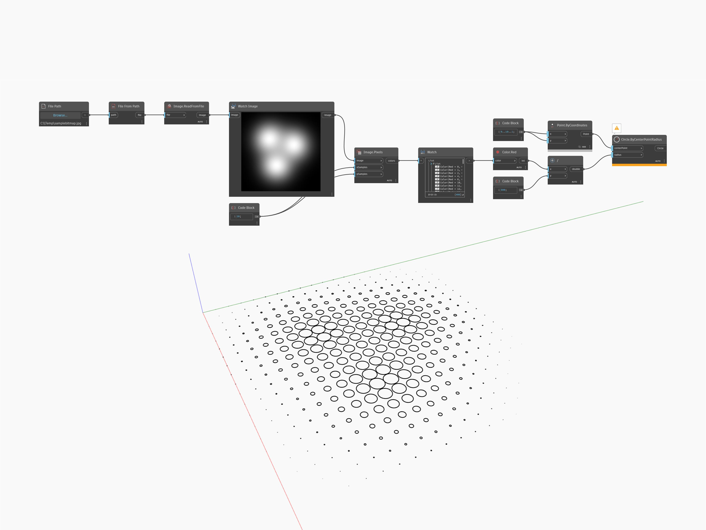

## In Depth
Watch Image will preview a bitmap. In the example below, a bitmap used as a height field is previewed in a Watch Image node. This allows us to compare the resulting geometry with the original image.
___
## Example File

