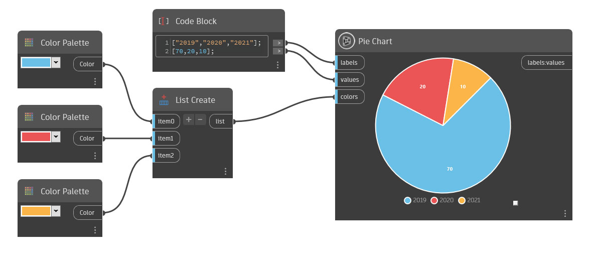

## In Depth

Pie Chart creates a circular graph divided into segments. You can label, color, and assign values for each segment.

Label the segments by entering a list of string values in the labels input. By default, these labels are Item1, Item2, and Item3.

Define values for each segment by inserting a list of double values in the values input. Note that the number of values must be equal to the number of labels set in the labels input. These values can be greater than 100.

Each segment will have a default color unless you define new colors by inserting a list of colors in the colors input. If no colors are defined, the random colors will change each time you make a change to the pie chart.
___
## Example File

