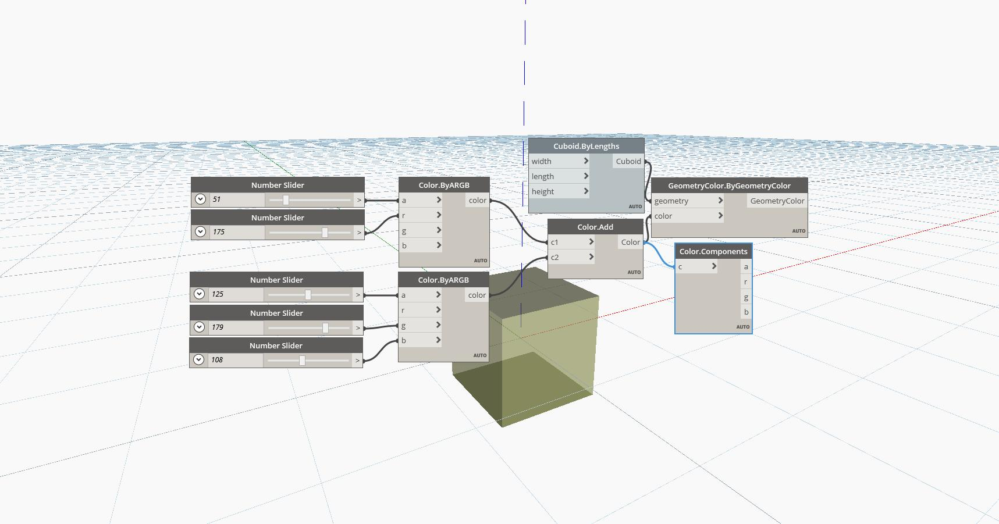

## In Depth
Components will return the Days, Hours, Minutes, etc of a TimeSpan. In the example below, a TimeSpan of 5:16:21 returns 0 Days, 5 Hours, 6 Minutes, 21 Seconds, and 0 Milliseconds.
___
## Example File

