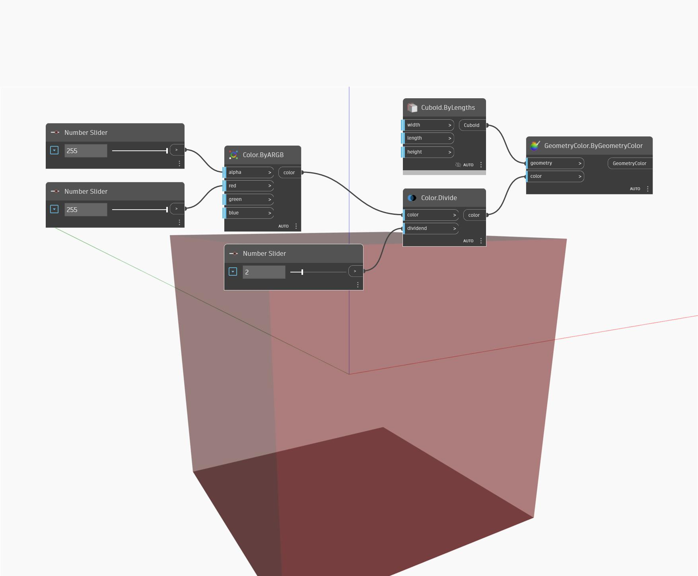

## In Depth
Divide will divide the individual channels of a color by an input number, and return the resulting color. Note that the resulting values must be less than 255. In the example below, we create a color using ByARGB nodes. We then use a Divide node to divide the color by a number controlled with a number slider. A Display.ByGeometryColor node is used with a default cuboid in order to visualize the resulting color.
___
## Example File

