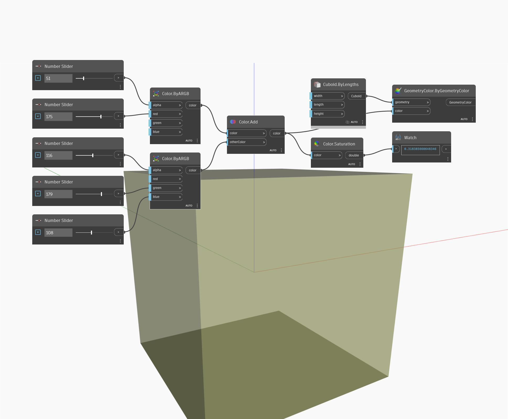

## In Depth
Saturation will return the saturation value of an input color in the range 0 to 1. In the example below, we create two colors using ByARGB nodes, and then add the two colors together. The saturation value of the resulting color is found by using a Saturation node.
___
## Example File

